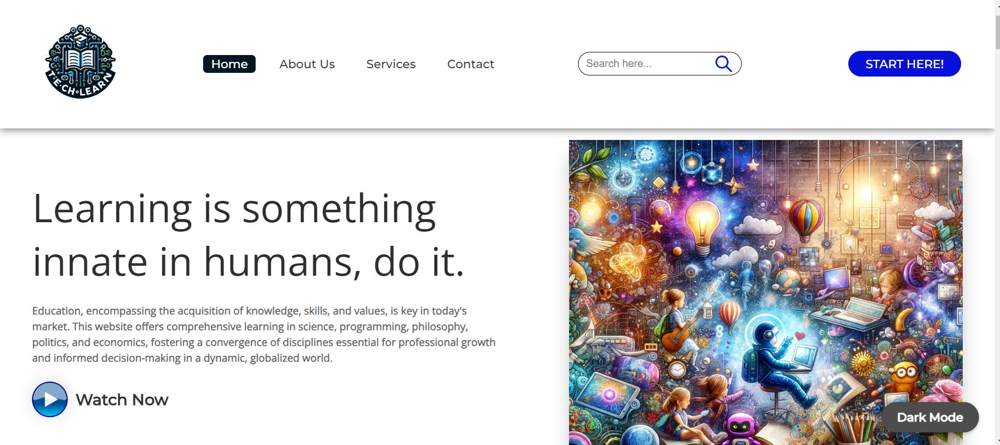

## OLEarn Digital (Online Learning Website)
Education online for students

This education Website for HCI would provide all the education related stuffs:  
Notes, Sample Papers, Online Video Lectures and courses to crack competitive  
exams like React, React Native, Next JS, Angular, etc. Students can clear their doubts by sending their questions to our website. The best is Quizzes for Students who are willing to solve problems on different topics. 
  
✔ Responsive website so, students or users can easily access our website from  any device.  
✔ Quiz Section is an interesting feature for students which provide them with  
   lots of questions. They can view their scores easily and solutions of every questions.  
✔ Projects – in this I have added a project section where students from schools and colleges can get projects for final year Projects.  
 
